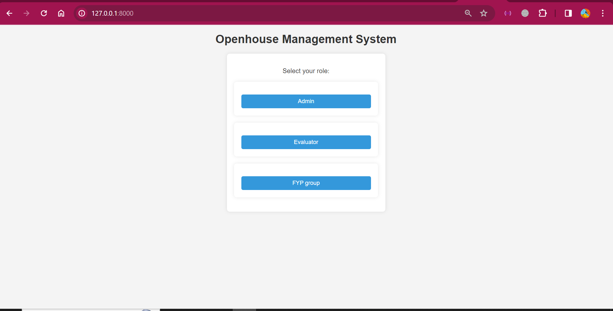
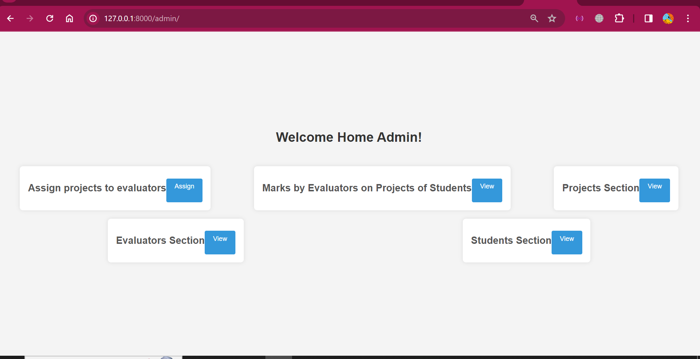
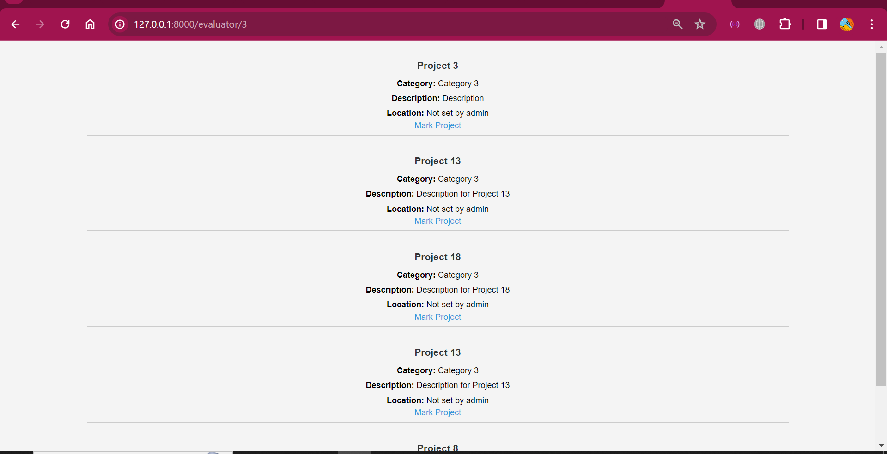
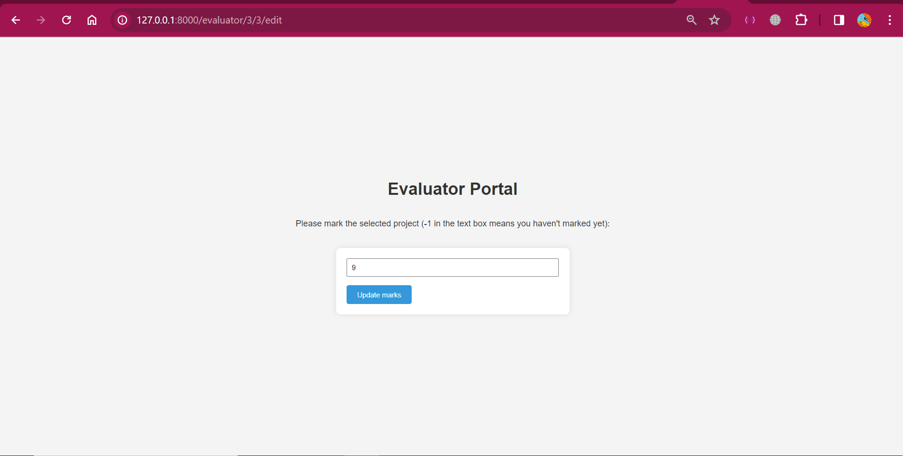
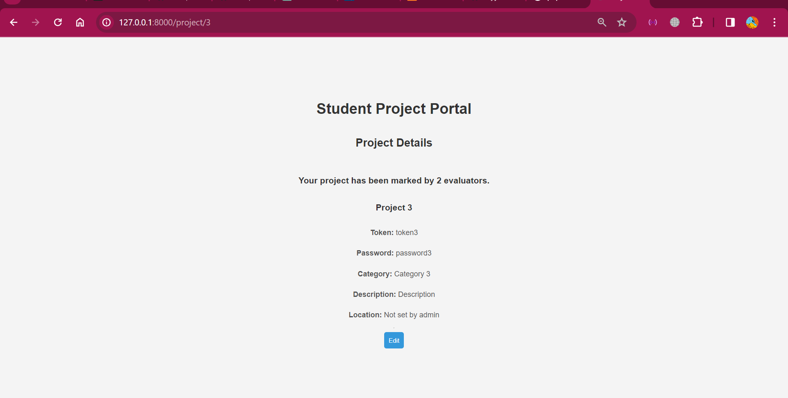
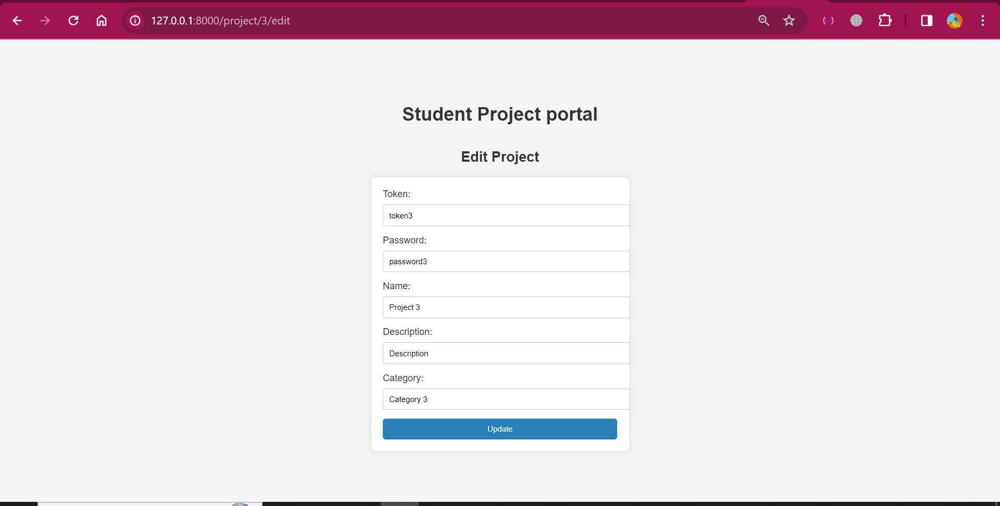

# Open House Management Platform

Welcome to the Open House Management Platform! This platform is designed to efficiently manage the assignment and evaluation of Final Year Projects (FYP) during the annual open house at NUST-SEECS.

## Table of Contents

- [Features](#features)
- [Technical Stack](#technical-stack)
- [Setup Instructions](#setup-instructions)
- [Usage and Frontend](#website-usage)
- [Enhancing FYP Evaluation Efficiency](#enhancing-fyp-evaluation-efficiency)


## Features

### User Accounts

- **Guests (Evaluators):** Create dedicated accounts to set preferences, including preferred project categories and specialty areas.
- **FYP Groups:** Manage project details and assign keywords.

### Admin Account

- Set the physical location of each FYP project on the demonstration floor.

### Project Assignment

- Randomly assign projects to guests based on matching keywords and evaluator preferences.
- Each evaluator will be assigned to evaluate between 3-5 projects.

### Evaluation Process

- Evaluators can rate each project on a scale of 1-10.
- Evaluation results are visible only to the admin.

### Student Access

- Students can view the number of evaluators who have assessed their project.
- Individual evaluator scores are not accessible to students.

## Technical Stack

- **Server Side:** Laravel

## Setup Instructions

1. **Clone the Repository:**
   ```bash
   git clone https://github.com/yourusername/openhouse-management.git
   ```
2. **Navigate to the Project Directory:**
   ```bash
   cd code
   ```
3. **Install Dependencies:**
   ```bash
   composer install
   ```
4. Run XAMPP server and the mySql service of XAMPP
5. **Serve the project on localhost using:**
    ```bash
    php artisan serve
    ```
6. **Open phpMyAdmin on browser:**
   ```bash
   http://127.0.0.1/phpmyadmin/
   ```
7. Go to databases tab

8. **Create a database using phpmyadmin GUI**
   ```bash
   Just enter name of the database in input field showing up on the page, and click Create.
   ```
9. Choose the newly created database in phpmyadmin
10. Click on the SQL tab showing in top bar
11. Copy the code from 
```code/sql/queries.sql``` file
12. Paste the code in phpmyadmin sql text area
13. Click on 'Go'. This will create a database.
14. Now you can view records of admins, evaluators, and projects (FYP Groups) from the phpmyAdmin.
15. Go to the url:
    ```bash
    http://127.0.0.1:8000/
    ```
16. Choose records from database tables as login credentials to login.

## Website Usage

### Login Interface
There are three types of users in my application:
1. Admin 
2. Evaluators
3. FYP Groups / Projects



### Admin Interface
The admin can manipulate records of students, projects, as well as evaluators. This can be seen in the image below. Moreover, the admin can Assign projects to evaluators. Initially you have to click the first button to assign projects to evaluators. Apart from that, admin can view the scores which each evaluator assigned to different projects.
Here is the admin dashboard:



You can go to any of the projects, evaluators, students sections in the admin portal. All of them allow CRUD operations on projects, evaluators and students respectively. You can do things like delete a project, assign location to a project, fire evaluators etc.

### Evaluator Interface
The evaluator sees on home page the projects he/she is assigned to. He/she can view location of the each project. Moreover, they can do markings on any of the assigned projects which will not be visible to anyone other than the admin.





### FYP Groups Interface
In this interface, the logged in students an view the details of their projects. They can see that how many evaluators evaluated their project, but the details of individual marks or evaluators are not revealed to the student. Students, just like evaluators, can update the keywords (category) of their project so that their project is assigned to well-suited evaluators in future.






## Enhancing FYP Evaluation Efficiency

The Open House Management Platform is designed to significantly enhance the efficiency of the Final Year Project (FYP) evaluation process.

### Intelligent Project Assignment for Expertise Alignment

The platform employs a sophisticated project assignment algorithm that ensures evaluators are matched with projects aligned with their preferences and specialty areas.


### Fairness Through Keyword Matching and Limited Workload

To ensure fairness in the evaluation process, the system incorporates a category matching mechanism. Each project and evaluator profile includes project category. The matching of this category ensures an equitable distribution of projects among evaluators, minimizing biases and promoting a balanced assessment. Furthermore, the platform strategically limits the workload for each evaluator to a range of 3-5 projects. This deliberate limitation is aimed at providing evaluators with a manageable workload, allowing them to focus on each project thoroughly. By preventing an overwhelming workload, the platform promotes in-depth evaluations, fostering constructive feedback and fair assessments.

### Transparency and Anonymity in Evaluation

The website places a strong emphasis on transparency and anonymity in the evaluation process. Students can't see who marked their projects. Moreover, only admins have certain priveleges such as setting location of a project, and adding, deleting, and updating students, projects and evaluators etc.
